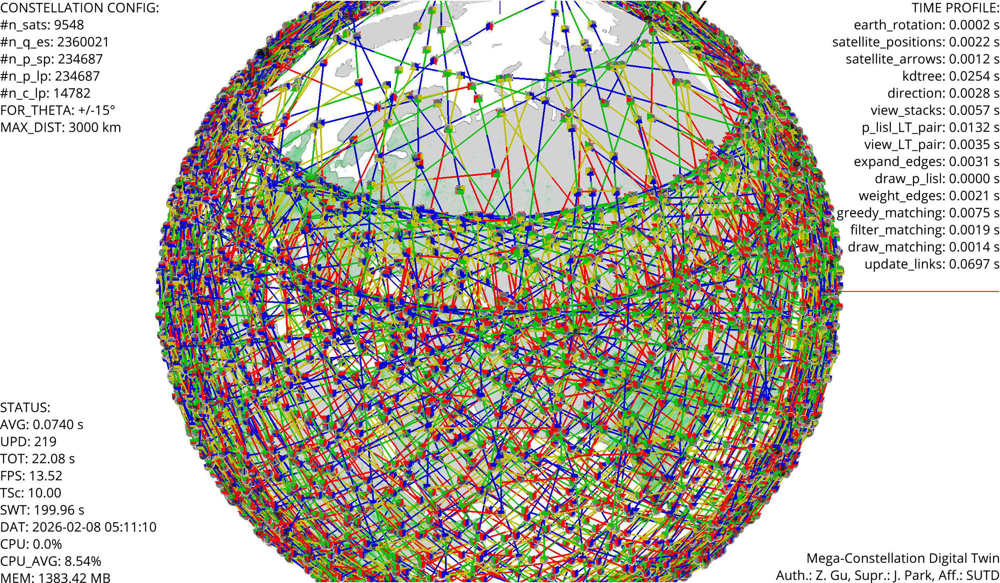
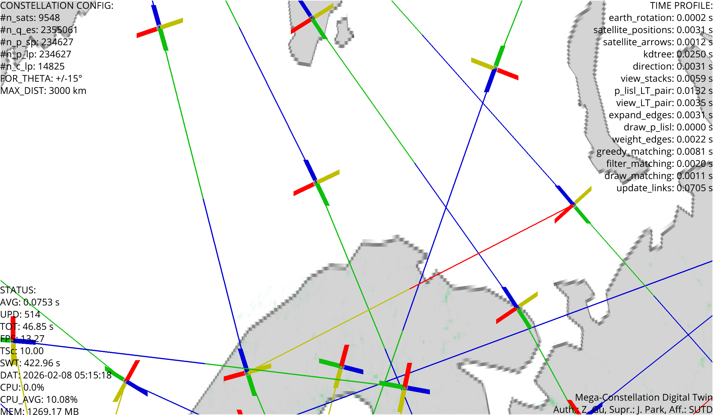

# 🛰️ Mega-Constellation Digital Twin
## A 3D Starlink LISL Visualizer
<!-- # Mega-Constellation Digital Twin: A 3D Starlink LISL Visualizer -->
*The entire Starlink constellation in one frame. Black dots are satellites; colored lines show active laser links between satellites.*


**Ever wondered how thousands of satellites communicate with each other in space?** This project brings mega-constellations to life with a real-time 3D visualization and research-grade digital twin platform. Watch Starlink satellites orbit Earth, compute laser inter-satellite links (LISL), and explore the future of global connectivity!

## Why This Project Matters 🌌

Mega-constellations like Starlink are revolutionizing internet access and space communication. With over 9,400 active satellites (and more deploying continuously), managing such vast networks requires intelligent algorithms for:
- **Real-time link prediction** – Which satellites can "see" each other?
- **Routing optimization** – How do data packets navigate through a moving network?
- **Constellation dynamics** – How does orbital mechanics affect network topology?

This digital twin is your interactive playground to **experiment, learn, and research** these fundamental challenges.

## Features ✨

- **Live satellite tracking** – Real TLE data from Celestrak; satellites update every frame
- **Laser link visualization** – See which satellites can communicate (±15° field of regard, 3,000 km range)
- **High-performance kernels** – Numba-accelerated numerical computation for thousands of satellites
- **Data-first architecture** – Optimized for research: inspect and modify the pipeline directly
- **Interactive 3D viewer** – Rotate, zoom, and capture screenshots of the constellation

## Demo & Visualization 🎥

In this demo, we use two-line element (TLE) data of Starlink satellites from [CelesTrak](https://celestrak.org) to simulate the orbital dynamics of a mega-constellation. **As of January 2026, Starlink operates over 9,400 active satellites** in low Earth orbit, with a target of deploying nearly 12,000 satellites across three orbital shells at altitudes of 525–535 km (primary), 340–360 km, and 604–614 km.

🌍 **Satellite and Earth dynamics** are computed in the International Celestial Reference System (ICRS) frame using Python's SGP4 and Skyfield libraries. The simulation setup starts at the world's current time according to the TLE data and runs at **10× real-time speed** for easy observation.

💫 **Laser Communication Terminals (LCTs):** Each satellite in this simulation is equipped with four laser terminals:
- 🔵 **Front** – nominal direction of motion
- 🟢 **Back** – opposite direction  
- 🟡 **Right** – starboard side
- 🔴 **Left** – port side

For this simulation, we configure each LCT with a **3,000 km transmission range** and a **±15° field of regard** (these are configurable research parameters, not necessarily exact Starlink specifications—actual Starlink ISL specifications are proprietary). When two satellites are close enough and their LCTs "see" each other, a laser link forms. The algorithm efficiently matches these links to maintain constellation connectivity.


### Zoomed View: Laser Terminal Configuration



*Close-up view showing individual satellites and their four colored laser terminals (front, back, left, right). This visualizes the directional constraints for link establishment.*

## Quick Glossary 📚

- **TLE** – Two-Line Element set; compact format for satellite orbital parameters
- **LISL** – Laser Inter-Satellite Link; direct optical communication between two satellites
- **LCT** – Laser Communication Terminal; transmitter/receiver on each satellite
- **LEO** – Low Earth Orbit; typically 400–2,000 km altitude
- **Mega-constellation** – Network of 1,000+ satellites in coordinated orbits

## Research Papers 📖

This code is built for research exploring real-time connectivity and routing in LEO constellations:

1) [Duality-Guided Graph Learning for Real-Time Joint Connectivity and Routing in LEO Mega-Constellations](https://arxiv.org/abs/2601.21921)
2) [Joint Laser Inter-Satellite Link Matching and Traffic Flow Routing in LEO Mega-Constellations via Lagrangian Duality](https://arxiv.org/abs/2601.21914)

**BibTeX:**

```bibtex
@article{gu2026duality,
   title={Duality-Guided Graph Learning for Real-Time Joint Connectivity and Routing in LEO Mega-Constellations},
   author={Gu, Zhouyou and Choi, Jinho and Quek, Tony Q. S. and Park, Jihong},
   journal={arXiv preprint arXiv:2601.21921},
   year={2026}
}

@article{gu2026joint,
   title={Joint Laser Inter-Satellite Link Matching and Traffic Flow Routing in LEO Mega-Constellations via Lagrangian Duality},
   author={Gu, Zhouyou and Park, Jihong and Choi, Jinho},
   journal={arXiv preprint arXiv:2601.21914},
   year={2026}
}
```

**Author:** Zhouyou Gu, Research Fellow at Singapore University of Technology and Design (SUTD), supervised by Prof. Jihong Park.

## How It Works: Data-Oriented Design 🏗️

Instead of simulating each satellite as a separate object (the traditional way), this digital twin keeps all constellation data in **dense arrays** and processes them together. Why?

**Traditional approach (slow):**
- Create 9,400+ satellite objects
- Update each object individually
- Check pairs for links → O(n²) overhead
- Result: Lots of Python overhead, poor GPU utilization

**Data-oriented approach (fast):**
- Store all positions in one array
- Compute all links in vectorized batches
- Use Numba JIT compilation for speed
- Result: Process thousands of satellites in milliseconds

**Benefits for research:**
- ✅ Easy to inspect the pipeline: all data is visible in arrays
- ✅ Easy to experiment: modify array operations without refactoring objects
- ✅ Easy to scale: add more satellites without restructuring code
- ✅ Easy to profile: identify bottlenecks in specific kernels

## Repository Layout 📂

- [simulation.py](simulation.py) – Main digital twin entry point, numerical kernels, and visualization loop
- [requirements.txt](requirements.txt) – Python dependencies
- [population_density_texture.png](population_density_texture.png) – Earth texture for the 3D sphere
- [images/example/](images/example/) – Demo screenshots

## Requirements 💻

- **Python 3.9+** recommended
- **GPU/OpenGL-capable** environment for Vispy rendering
- ~500 MB disk space for dependencies

## Quick Start (Beginner-Friendly) 🚀

New to Python? Follow these exact steps.

### 1️⃣ Create a Virtual Environment

```bash
python -m venv .venv
source .venv/bin/activate  # macOS/Linux
.\.venv\Scripts\activate   # Windows
```

A virtual environment keeps project dependencies isolated (best practice!).

### 2️⃣ Install Dependencies

```bash
pip install -r requirements.txt
```

This installs all required packages: Skyfield, Numba, Vispy, SGP4, etc.

### 3️⃣ Get the Earth Texture

The project needs a texture image to visualize Earth. Make sure this file exists in the project root:
- **population_density_texture.png**

If you don't have it, download a world map image and place it next to `simulation.py`.

### 4️⃣ Run the Simulation

```bash
python simulation.py
```

You should see within 30–60 seconds:
- ✅ A window opens with a white background
- ✅ A rotating Earth sphere appears
- ✅ Black dots (satellites) populate the view
- ✅ Colored lines (laser links) form between nearby satellites
- ✅ Overlay text shows constellation stats and performance metrics

## Mouse & Keyboard Controls 🎮

- **Left-drag** – Rotate camera around Earth
- **Scroll wheel** – Zoom in/out
- **Double-click** – Save a high-res screenshot to `/images/` (useful for your research!)
  - Filename format: `screenshot_YYYYMMDD_HHMMSS_NNNNN.png`
  - The `/images` folder is created automatically
- **Left-click (hold)** – Record a GIF while holding the button; release to save
   - Saved under `/images/gifs/`
   - Max duration is `gif_max_frames / gif_fps`

## Configuration 🎛️

Simulation parameters are in [simulation.py](simulation.py) under `DigitalTwinConfig`:

```python
@dataclass(frozen=True)
class DigitalTwinConfig:
    for_theta_deg: float = 15.0              # ±15° field of regard (smaller = stricter view constraint)
    lisl_max_distance_km: float = 3000.0     # 3,000 km max transmission range
    time_scale: float = 10.0                 # Run 10× faster than real time
    earth_radius_km: float = 6371.0          # Earth radius for normalization
    plot_potential_lisl: bool = False        # Show all candidate links (slower)
    texture_path: str = "population_density_texture.png"
    arrow_length_scale: float = 0.01         # Size of directional arrows
```

Capture parameters are separate under `CaptureConfig`:

```python
@dataclass(frozen=True)
class CaptureConfig:
   screenshot_dir: str = "images"
   gif_fps: int = 15
   gif_max_frames: int = 300
   gif_output_dir: str = "images/gifs"
   gif_scale: float = 0.5
   gif_colors: int = 128

```

**Want to experiment?** Try these modifications:

| Change | Effect |
|--------|--------|
| `time_scale = 60.0` | Speed up simulation to 60× real-time |
| `lisl_max_distance_km = 5000.0` | Larger coverage area → more links |
| `for_theta_deg = 20.0` | Wider field of regard (easier links) |
| `plot_potential_lisl = True` | Show all candidate links (CPU-heavy) |

## Performance Tips 🚄

If it's running slowly:

1. **Reduce time scale** – Lower `time_scale` to 5.0 for easier real-time computation
2. **Smaller TLE set** – Change the satellite URL in `main()` to a smaller constellation (e.g., OneWeb instead of full Starlink)
3. **Turn off potential LISL** – Set `plot_potential_lisl = False` to skip drawing all candidates
4. **Increase FOR threshold** – Raise `for_theta_deg` to 20–25 to skip stricter view checks
5. **Check your GPU** – On first run, Numba JIT-compiles kernels (30–60 sec delay is normal)

## Common Issues & Solutions 🆘

| Issue | Solution |
|-------|----------|
| **Blank window that stays white** | Wait 60 seconds for Numba JIT compilation; check OpenGL support |
| **"Module not found" error** | Activate venv: `source .venv/bin/activate` and reinstall: `pip install -r requirements.txt` |
| **"No module named vispy"** | Vispy needs OpenGL. On Linux, install: `sudo apt install libgl1` |
| **TLE loading is very slow** | Network is slow; try offline mode or use a smaller constellation URL |
| **Very low FPS (<5)** | Reduce `time_scale`, disable `plot_potential_lisl`, or increase `for_theta_deg` |
| **High memory usage (>2GB)** | Reduce constellation size or disable texture rendering |

## Beginner's FAQ 🤔

**Q: What is a TLE?**  
A: A Two-Line Element is a compact format for storing satellite orbital parameters. It's updated regularly by NORAD and freely available from CelesTrak.

**Q: How many satellites does Starlink have?**  
A: As of February 2026, Starlink operates over 9,400 active satellites in low Earth orbit, with a target of nearly 12,000 total. Mega-constellations require this scale to provide global coverage with low latency.

**Q: Why laser links instead of radio?**  
A: Laser links have much higher bandwidth (Gbps) and lower latency than radio. They're harder to engineer but future-proof for data demands.

**Q: Can I use this for a class project?**  
A: Yes! This is great for computer graphics, networking, optimization, or physics projects. Cite the papers above.

**Q: Can I modify the code?**  
A: Absolutely. The data-oriented design makes it easy to add features (new LCT configurations, different orbit types, routing algorithms, etc.).

## Next Steps for Learning 📚

1. **Understand TLEs** – Read about orbital mechanics and SGP4 propagation
2. **Explore the code** – Find the numerical kernels and see how they compute links
3. **Experiment** – Change constellation parameters and observe effects
4. **Extend it** – Add routing algorithms, interference modeling, or handover strategies
5. **Research** – Read the papers above and implement new matching or optimization techniques

## Notes 📝

- **First run is slow** – Numba JIT-compiles all kernels on first execution (30–60 sec)
- **Network updates** – TLE data is fetched fresh from CelesTrak each run
- **Memory usage** – Scales linearly with satellite count (9,400 sats ≈ 200 MB RAM)
- **GPU-accelerated** – Vispy rendering offloads to GPU when available
- **Research-grade** – Pipeline is inspectable and easy to modify for experiments

## Tested Platforms 🖥️

- ✅ **macOS** – MacBook Pro (M4, 2024) @ FPS 15–25 for full Starlink constellation

## Citation & Contributing 🙌

If you use this tool or the research described here, please cite the papers above or acknowledge this repository and author in your work.

**Have ideas for improvements?** Open an issue or submit a pull request. We welcome contributions from students and researchers!

## License 📜

MIT License. See [LICENSE](LICENSE) for details. Use freely in research and education.

---

**Questions?** Reach out to Zhouyou Gu or explore the code directly. Have fun visualizing the future of space communications! 🚀
